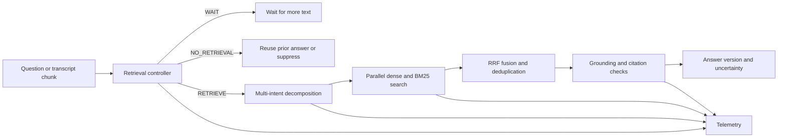

# Streaming Live RAG

Streaming Live RAG is a retrieval-augmented question-answering service for the bundled workshop-planning corpus. It accepts complete questions over HTTP or transcript fragments over WebSocket, decides when enough intent is available to search, splits compound requests into subqueries, and grounds answers in retrieved corpus passages.

The system includes a retrieval controller, multi-intent decomposer, hybrid dense/sparse retriever, session-aware synthesizer, and structured telemetry. It supports late-detail refinement and presentation-only requests that reuse an existing answer without searching again. PRISM_GENAI_HACKATHON_Y2026.DEMO(https://drive.google.com/file/d/1RryWacdLqB5szCqar0apQAq6f_hGNlxm/view?usp=sharing)
SRMIST_BigLeagues_Submission (https://docs.google.com/presentation/d/1MIY9fILpV61CoCzil3PvVgkSFv9kSkYM/edit?)usp=sharing&ouid=115566261664605086512&rtpof=true&sd=true
## Contents

- [Features](#features)
- [How it works](#how-it-works)
- [Requirements](#requirements)
- [Local setup](#local-setup)
- [Docker Compose](#docker-compose)
- [HTTP API](#http-api)
- [Streaming WebSocket API](#streaming-websocket-api)
- [Sessions](#sessions)
- [Corpus and retrieval](#corpus-and-retrieval)
- [Grounding and uncertainty](#grounding-and-uncertainty)
- [Evaluation](#evaluation)
- [Telemetry](#telemetry)
- [Configuration](#configuration)
- [Repository layout](#repository-layout)
- [Troubleshooting](#troubleshooting)
- [Known limitations](#known-limitations)

## Features

- Incremental `WAIT`, `RETRIEVE`, and `NO_RETRIEVAL` decisions.
- Up to four distinct subqueries for compound requests, retrieved in parallel.
- Local sentence-transformer embeddings, ChromaDB vector search, BM25 lexical search, reciprocal rank fusion, and repeated-section removal.
- Session-scoped answer versions and delta retrieval for late details.
- Presentation requests such as “shorten that”, “translate that”, and “make it formal” that do not trigger retrieval.
- Exact source-excerpt checks, inline citations, named-venue checks, and uncertainty when the corpus cannot support a response.
- Per-request trace IDs, retrieval timings, answer lineage, token usage, and estimated inference cost.

## How it works



For WebSocket requests, the controller evaluates the accumulated transcript after each chunk. A stable intent can start provisional retrieval before the utterance ends. Later chunks can add new subqueries. Synthesis returns an answer when the client sends `is_final: true`.

## Requirements

- Python 3.11 is the pinned/container runtime. The project has also been exercised locally with Python 3.12.
- One text-generation backend:
  - **Ollama**, with a model installed locally; or
  - **Groq**, with a valid API key, model, and available quota.
- Internet access on first start if the `all-MiniLM-L6-v2` embedding model is not already cached.
- Docker Desktop with Linux containers for the Docker instructions.

### Data handling

The corpus, vector index, and embeddings are stored and searched locally. With Ollama, prompts and retrieved passages are sent to the configured Ollama host. With Groq, prompts and retrieved passages are sent to Groq for controller decisions, decomposition, and answer generation. Choose the backend according to your data-handling needs. Do not commit `.env` or put API keys in source files.

## Local setup

From the repository root, create `.env` from the template only if `.env` does not already exist:

```powershell
python -m venv .venv
.\.venv\Scripts\Activate.ps1
pip install -r requirements.txt
Copy-Item .env.example .env
```

On macOS/Linux, activate the environment with `source .venv/bin/activate`.

### Configure Ollama

The template defaults to Ollama. Start Ollama and install the configured model:

```powershell
ollama pull gemma4:26b
```

Set these values in `.env` if the host or model differs:

```dotenv
LLM_BACKEND=ollama
OLLAMA_HOST=http://localhost:11434
OLLAMA_MODEL=gemma4:26b
```

Ollama must be running before requests that need inference. Local inference has no provider token charge; speed depends on the model and machine.

### Configure Groq

Set the backend, key, and model in `.env`:

```dotenv
LLM_BACKEND=groq
GROQ_API_KEY=your_groq_api_key
GROQ_MODEL=openai/gpt-oss-20b
```

Evaluation makes many model calls and can hit provider request or token limits. Failed inference calls are recorded as `llm_failure`; affected traces are incomplete for cost coverage.

### Start the API

```powershell
python -m src.api.main
```

The API listens on `http://localhost:8000`. Verify it with:

```powershell
Invoke-RestMethod http://localhost:8000/health
```

Interactive API docs are at `http://localhost:8000/docs`.

## Docker Compose

Compose defaults to Ollama on the host at `host.docker.internal:11434`:

```powershell
docker compose up --build
```

For a clean build and offline test replay:

```powershell
docker compose build --no-cache
docker compose run --rm --no-deps streaming-rag pytest -q
```

The image downloads the embedding model and indexes the corpus during its build. Compose stores telemetry in the `telemetry_data` volume at `/var/log/rag`; the bundled corpus and Chroma index remain under `/app/data`.

Check a running service with `docker compose ps` and request `http://localhost:8000/health`. If Docker cannot connect to `dockerDesktopLinuxEngine`, start or restart Docker Desktop and wait for its Linux engine. To use Groq in Compose, set `LLM_BACKEND=groq` and `GROQ_API_KEY` in `.env`.

## HTTP API

Requests and responses use JSON. HTTP responses include an `X-RAG-Trace-ID` header. A synthesis response normally contains `session_id`, `answer`, `citations`, `uncertainty`, `answer_version`, `sub_queries`, and `retrieval_events`. Fields vary with the controller decision.

### Health

```http
GET /health
```

Example: `{"status":"ok","version":"1.0.0"}`.

### Ask a question

```http
POST /api/query
Content-Type: application/json
```

```json
{
  "utterance": "What is the seating capacity of Venue B?",
  "session_id": "optional-existing-session-id"
}
```

Omit `session_id` to start a new session. A `WAIT` decision can return `status: "waiting_for_more_input"` without an answer. A clear request is decomposed, retrieved, and synthesized.

### Refine an answer

```http
POST /api/refine
Content-Type: application/json
```

```json
{
  "session_id": "session-id-from-the-first-answer",
  "new_detail": "The booking is during monsoon season."
}
```

The service retrieves against the new detail, updates the existing answer session, and returns the next answer version with `late_constraint_delta` retrieval events.

### Reformat without retrieval

```http
POST /api/presentation
Content-Type: application/json
```

```json
{
  "session_id": "session-id-from-the-first-answer",
  "request": "Make that shorter and use two bullets."
}
```

Presentation turns reuse prior citations and do not call the retriever. If reformatting would break source support, the verified prior answer is returned.

### Create a session

```http
POST /api/session/create
```

Returns `{"session_id":"…"}` for use in subsequent calls.

### Evaluate the controller

```http
POST /api/controller/evaluate?session_id=debug&cumulative_text=What%20is%20Venue%20B%20capacity%3F&timestamp_s=0.8&controller_type=rule_based
```

Use `controller_type=rule_based` for the local heuristic controller; omit it to use the configured LLM controller. The response contains the decision, reason, confidence, and timestamp.

### Read telemetry

```http
GET /api/telemetry/events
GET /api/telemetry/events?session_id=session-id
GET /api/telemetry/report
GET /api/telemetry/report?session_id=session-id
```

The events endpoint returns matching event records as a JSON array; the persistent log file itself is JSON Lines.

## Streaming WebSocket API

Connect to `ws://localhost:8000/ws/stream`. The first server message is `session_start` with the new session ID. Send transcript fragments as JSON:

```json
{"chunk_text":"I need to plan a customer workshop in…","timestamp_s":0.0,"is_final":false}
```

Append subsequent fragments rather than resending the full transcript:

```json
{"chunk_text":"…Pune for 30 people, and I need…","timestamp_s":0.8,"is_final":false}
{"chunk_text":"…the cancellation policy and the catering options.","timestamp_s":1.6,"is_final":false}
{"chunk_text":"","timestamp_s":2.1,"is_final":true}
```

`is_final: true` marks the end of the current utterance. Server events can include:

- `controller_decision`: `WAIT`, `RETRIEVE`, or `NO_RETRIEVAL`.
- `retrieval_started`: provisional retrieval has begun.
- `decomposition`: all discovered subqueries and newly added subqueries.
- `retrieval_complete`: source-mapped retrieval events and result count.
- `provisional_context_ready`: current evidence is ready while the utterance continues.
- `answer`: completed answer with citations, uncertainty, and answer version.
- `no_action`, `retrieval_skipped`, or `incomplete_utterance`: no search was needed, no new intent was found, or final text was insufficient.

The event sequence depends on the controller and whether new intents are found. A WebSocket connection owns one session; finalized utterances reset pending transcript state while preserving the session's answer history.

## Sessions

Answer state is process-local and in-memory. It includes answer versions, citations, subquery history, and retrieved evidence for refinement and presentation. Sessions are not shared between workers and disappear when the API restarts. Telemetry does not restore answer state.

For production use, put the API behind an authenticated gateway. Use a shared session store and define an expiration policy if requests can move between workers or replicas.

## Corpus and retrieval

The bundled corpus is `data/corpus/workshop_planning_corpus.json` with 19 source records across 15 document IDs. Each record has a document ID, section, title, and source text. Retrieval is limited to this supplied corpus; there is no web-search or external knowledge-base retrieval path.

The retriever embeds queries locally with `all-MiniLM-L6-v2`, searches ChromaDB and BM25, combines the rankings with reciprocal rank fusion, and removes duplicate document sections across subqueries. The default index path is `data/chroma_index`; configure `CHROMA_PERSIST_DIR` to change it. Docker uses `/app/data/chroma_index` and indexes the corpus during image build. Rebuild or reindex after changing corpus records.

## Grounding and uncertainty

Citations use `[Doc_ID §Section]`. Citation metadata includes `doc_id`, `section`, and an exact `claim` excerpt. Validation checks inline citations per factual sentence, source text, and explicitly named venue references. Unsupported claims are removed. If generated text cannot be verified, the service can use a query-relevant exact excerpt from retrieved evidence; if no excerpt fits, it reports uncertainty rather than relying on model knowledge.

Exact quotation is a conservative provenance check. It may reject valid paraphrases and is not a general semantic entailment model.

## Evaluation

### Offline tests

Run from the repository root:

```powershell
pytest -q
```

Provider calls are mocked. Tests cover controller and decomposition behavior, retrieval, citation grounding, REST and WebSocket paths, telemetry, and evaluation-gate calculations. They do not measure live model quality, provider latency, or current quotas.

### Live gates

Start the API with a working backend, then run:

```powershell
python -m eval.run_gates
```

The runner reads 72 cases from `data/eval/test_utterances.json`.

| Gate | Measurement | Target |
| --- | --- | --- |
| G1 | Clean image build and replay | Run Docker build/test replay separately; the live runner leaves G1 unverified. |
| G2 | Early retrieval and false triggers | At least 80% early retrieval and at most 10% false triggers, with minimum samples. |
| G3 | Compound decomposition | At least 70% of at least 20 compound cases produce multiple subqueries. |
| G4 | Citation support and fabricated IDs | At least 85% supported, zero unsupported assertions, zero fabricated IDs, and at least 20 answers. |
| G5 | Refinement lineage and presentation suppression | At least 80% pass rate across at least 20 refinement/presentation checks. |
| G6 | Per-request trace and cost coverage | 100% complete traces and no unknown inference costs. |

A live run can take several minutes and makes many model calls. Check provider quotas first. Save its full output with the backend/model, corpus and fixture revisions, and run date.

### Paired REST/WebSocket baseline

With the API running, compare complete HTTP queries and incremental WebSocket queries on the same simple-query cases:

```powershell
python -m eval.compare_streaming_baseline --limit 3
```

The script records REST latency, time to first streaming retrieval, final streaming latency, and citation support in `data/streaming_baseline_results.json`. Increase `--limit` for a larger sample. Small samples do not establish production-wide performance.

### Component ablations

```powershell
python -m eval.ablations --help
python -m eval.ablations
```

The runner compares hybrid and dense-only retrieval and rule-based and model-based control. The model-based portion uses the configured provider. Checked-in `data/ablation_results.json` contains historical measurements, not a current reproducible benchmark. See [docs/benchmarking_report.md](docs/benchmarking_report.md) for measurement limits and current gaps.

## Telemetry

Events are JSON Lines records written to `TELEMETRY_LOG_PATH` and held in process memory for report endpoints. Each event includes `event_type`, `trace_id`, a UTC `timestamp`, stage-specific `data`, and `session_id` when available. The data records:

- HTTP/WebSocket route, status, and elapsed request time.
- Controller decisions, confidence, transcript time, and transcript character count.
- Decomposition, retrieval triggers, durations, result counts, and source IDs/sections.
- Answer version, previous version, citation sources, and uncertainty state.
- Model purpose, token counts, latency, estimated cost, and estimate status.
- Provider failure class without the provider message or credentials.

Groq `openai/gpt-oss-20b` uses the configured standard rates. Other remote models need both cost-rate variables configured; Ollama is recorded at zero provider cost. Estimates do not include local hardware costs or all provider discounts. Telemetry contains user queries and source references: protect its files and set an appropriate retention period. See [docs/telemetry_schema.md](docs/telemetry_schema.md) for field definitions.

## Configuration

| Variable | Default | Purpose |
| --- | --- | --- |
| `LLM_BACKEND` | `ollama` in `.env.example` | `ollama` or `groq`. |
| `GROQ_API_KEY` | Empty template value | Required for Groq. Keep it private. |
| `GROQ_MODEL` | `openai/gpt-oss-20b` | Groq model name. |
| `OLLAMA_HOST` | `http://localhost:11434` | Ollama API base URL. Compose uses `host.docker.internal` by default. |
| `OLLAMA_MODEL` | `gemma4:26b` | Model installed in Ollama. |
| `EMBEDDING_MODEL` | `all-MiniLM-L6-v2` | Local sentence-transformer model. |
| `CHROMA_PERSIST_DIR` | `./data/chroma_index` | ChromaDB persistence directory. |
| `TELEMETRY_LOG_PATH` | `./data/telemetry.jsonl` | JSON Lines event log. |
| `LLM_PROMPT_COST_PER_1M_TOKENS_USD` | Unset | Remote input-token rate override. |
| `LLM_COMPLETION_COST_PER_1M_TOKENS_USD` | Unset | Remote output-token rate override. |
| `API_HOST` | `0.0.0.0` in Compose | API bind interface. |
| `API_PORT` | `8000` in Compose | API port. |

See [.env.example](.env.example) for the full template. Do not commit `.env` or telemetry containing real user queries.

## Repository layout

```text
src/
  api/main.py              FastAPI routes and WebSocket stream
  controller/              Retrieval readiness and suppression decisions
  decomposer/              Compound-query decomposition
  retrieval/               ChromaDB, BM25, RRF, and deduplication
  synthesis/               Session state, grounding, citations, refinement
  telemetry/               Structured events, traces, and reports
  provenance.py            Evidence and section validation helpers
prompts/                   Controller, decomposition, synthesis, reformat prompts
data/
  corpus/                  Supplied source corpus
  chroma_index/            Persistent local vector index/cache
  eval/                    Live evaluation cases
eval/                      Gate runner, baseline comparison, component ablations
tests/                     Offline unit and integration tests
docs/                      Architecture, evaluation, telemetry, demo storyboard
```

## Troubleshooting

| Symptom | Likely cause | What to check |
| --- | --- | --- |
| `GROQ_API_KEY environment variable is required` | Groq selected without a key | Set the key in local `.env`, then restart the API. |
| Groq returns HTTP 429 | Provider request/token quota reached | Wait for quota reset or use a supported model/account with sufficient quota. Failed traces remain incomplete. |
| Groq JSON-mode request returns HTTP 400 | Provider/model rejected structured output | Inspect `llm_failure` events; synthesis can fall back to exact retrieved excerpts. Verify model support and retry. |
| Ollama connection refused | Ollama is stopped or host is wrong | Start Ollama and check `OLLAMA_HOST`; in Compose use the configured host address. |
| Docker cannot open `dockerDesktopLinuxEngine` | Docker Desktop Linux engine unavailable | Start/restart Docker Desktop, wait for its engine, then check `docker version` for both Client and Server. |
| First start downloads models | Model files are not cached | Let the initial embedding-model download finish. Docker downloads it during build. |
| Answer includes uncertainty or fewer citations | Evidence is absent or generated text failed source checks | Inspect retrieved passages and answer-version telemetry; unsupported text is removed. |
| Session-filtered report has no earlier events after restart | In-memory events were reset | Persistent JSONL output is at `TELEMETRY_LOG_PATH`; session state is not restored. |

## Known limitations

- Sessions are process-local and are not restored after restart.
- There is no built-in authentication, authorization, session expiration, or multi-tenant isolation.
- Exact quotation checks favor precision over paraphrase flexibility and do not prove semantic entailment beyond the quoted text.
- Corpus and evaluation fixtures focus on workshop planning; their results do not generalize to other domains.
- The live gate runner does not mark G1 passed by itself; a clean Docker build and replay are required.


For design and measurement details, see [the architecture brief](docs/architecture_brief.md) and [the benchmarking report](docs/benchmarking_report.md).
